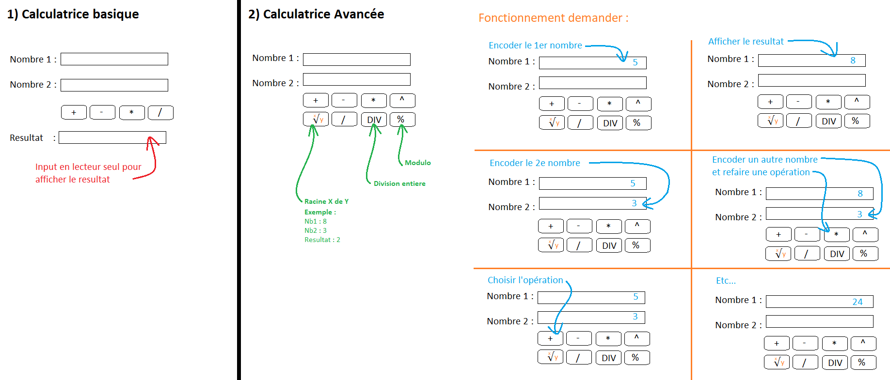

# Exercices

## Le tableau trié

Demandez à l'utilisateur d'entrer un nombre positif supérieur à 5
Ensuite, demandez à l'utilisateur d'entrez ce nombre de nombre pour remplir un tableau.

Attention le tableau doit être trié en temps réelle de manière descendante. (pas de sort() ni de reverse()).
n'utilisez que push(), unshit(), concat() et slice() et une boucle 'for' pour parcourir le tableau.

## Le jeu de bataille

Implémenté avec du DOM un jeu de bataille. [Jeu de bataille wikipédia](https://fr.wikipedia.org/wiki/Bataille_(jeu))

## 01 interaction avec le navigateur

Créer un nouveau projet Web :

+ un fichier html
+ un fichier JS

Dans le fichier JS faire :

+ Afficher dans la console un message d'attention avec le contenu « Hello World »
+ Permet à l'utilisateur d'encoder son nom et prenom (2 saisies diffs)
+ Afficher message via un popup pour dire bonjour à l'utilisateur

## 02 Intro DOM + variable

Créer un nouveau projet Web :

+ un fichier html
+ un fichier js
+ un fichier de style (css, sass, scss, ...)

Fonctionnalité :

+ Un titre dynamique
  + Initialement celui+ci indique « Bienvenue sur le site »
  + L'utilisateur peut encoder son nom avec une balise input et valider le changement avec un bouton
  + Le titre du site se modifie en « Bienvenue [...] »
+ Le site possede 2 themes (changement en cliquant sur un emoji)
  + Jour
  + Nuit

Bonus :

+ Après que l'utilisateur est validé son identité:
  + Le titre change de couleur .
  + L'input et le bouton sont déactivé.
+ Ajouter un bouton reset, qui restaure l'etat du site

## 03 Number



## 04 Boolean / Operateur d'égalité / Operateur logique

Avec les valeurs suivantes :

``` js
const a = 13;
const b = 22;
const c = 2;
const d = 42;
const e = 21;
const f = true;
const g = 26;
const h = 3.14;
const i = '42';
const k = 'Six';
const name1 = 'Riri';
const name2 = 'Fifi';
const name3 = 'Zaza';
const name4 = 'Loulou';
```

Trouvez les resultats pour :

``` js
 1) a > b
 2) (a + c) < b
 3) !(b > e)
 4) c > (b + e)
 5) (a * 2) >= g
 6) f && (a <= b) && (d/2 === e)
 7) (h * 2) > 6
 8) Math.floor(e / 2) > (g / a)
 9) (name1 > name2) && (name3 > name4)
10) (name1 > 'Donald') || (name4 > 'Balthazar')
11) (a > c) && !(e > g) && (a % 2 === 0) && !f
12) ((d === (e * 2)) || (e > g)) && (d === i)
13) ((a * 2) > (g / 2)) || f || ((g + b + c) > (d * h))
14) k > 5
```

## 05 Gestion des String

Sur base de la chaine de caractere suivantes_
« Développeur Fullstack JavaScript à DigitalCity ! », obtenir :

```javascript
const msg = 'Développeur Fullstack JavaScript à Bruxelles Formation !'
```

+ L'index du dernier caractere « a »
+ La position (humain) du texte « Java »
+ Remplacer « Bruxelles Formation » par « DigitalCity »
+ Supprimer le texte « Script » à JavaScript
+ Obtenir un tableau avec chaque mots de la phrase (mais sans prendre le « à ») => ["Développeur", "Fullstack", "JavaScript", "DigitalCity", "Bruxelles", "Formation"]

Exercices Bonus :

+ Inverser la chaine de caractere 🤯
+ Récuperer le 3e mot de la phrase et le mettre en majuscule

## 06 Le type Date

Créer une page Web pour afficher combien de temps il reste avant Noël (25/12).

Fonctionnalité :

+ Afficher le nombre de jours avant le prochain Noël.
+ Si c'est le 25/12, afficher « C'est Noël 🎄 »

Bonus :

+ Afficher la phrase suivante : « Nous sommes le 8 décembre 2023, il reste 17 jours avant Noël ! »

## 07 Structure conditionnel

Créer un nouveau projet Web :

+ un fichier html
+ un fichier js
+ un fichier de style (css, sass, scss, ...)

Description :
Faire une page Web qui permet à l'utilisateur de jouer au jeu du « Plus grand / Plus petit »

Une valeur aléatoire est générer entre 1 et 100.
L'utilisateur utilise une balise input (de type texte) pour encoder une valeur
et l'envoie ensuite à l'aide d'un bouton.
La page Web affiche un message en fonction de la valeur :

+ Plus petit
+ Plus grand
+ Bravo, vous avez trouvé en X essais !
+ Perdu 😥

L'utilisateur à 10 tentative symbolisé par des coeurs, après chaque erreur un coeur est perdu (grisé).
Si l'utilisateur encode une valeur érroné (Exemple: « Cinq »), celui+ci ne perte pas de vie.

Une fois que la partie est terminé (réussite ou echec), l'utilisateur peut relancer une partie.

## 08 DOM avancé

Créer un nouveau projet Web :

+ un fichier html
+ un fichier js
+ un fichier de style (css, sass, scss, ...)

Créer un gestionnaire de contacts.
Permettre à un utilisateur d'encoder le nom, le prénom, l'email et le numéro de téléphone.

Pour chaque ajout, on ajoute une DIV à la page présentant au format carte les infos du contact.
